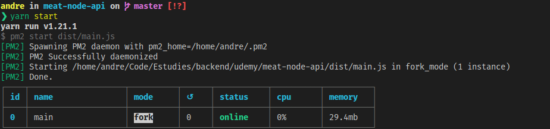

# MEAT API

Meat API é um projeto prático desenvolvido no curso **API Restful com NodeJS, Restify e MongoDB** da [Udemy](https://www.udemy.com/) no qual é abordado a criação de uma API de restaurantes.

# Funcionalidades!

- Administração de usuários (clientes).
- Avaliação de restaurantes.
- Administração de restaurantes.
- Autenticação de autorização.

Você também pode acessar a documentação dos recursos [Aqui]().
Essa aplicação implementa os principais conceitos da Arquitetura REST e seus 5 principais requisitos para que seja considerado uma API [Restful](https://restfulapi.net/).

### Tecnologias

MEAT API aplica as tecnologias mais comuns usadas no universo javascript, tais como:

- [Typescript]().
- [Mongo]().
- [Mongoose]().
- [Restify]().
- [Jest]().
- [Supertest]().
- [bcript]().
- [Json Web Token]().
- [pm2]().

### Infraestrutura

- [Docker]().
- [Docker Compose]().

### Instalação

MEAT API precisa do [Node.js](https://nodejs.org/) v14.4+ para ser executado. Com o nodejs
instalado execute os seguintes comandos:

```sh
$ yarn install
```

```sh
$ yarn dev
```

### Banco de dados

Como armazenamento persistente foi utilizado o mongodb. Afim de evitar problemas com plataformas usamos
o `docker-compose` e `docker`, sendo assim, após instalados essas ferramentas apenas basta apenas
executar o comando:

```sh
$ docker-compose up -d
```

O comando acima irá criar um container no qual irá executar o mongo na porta 27017. Como estamos
utilizando o `nodemon` a aplicação irá conectar automáticamente ao banco de dados. Para informações
de string connection, veja o arquivo `env.ts` localizado na pasta `src/common`.

### Executando em produção.

Para executar esse projeto em produção instale todas a dependências execute o comando `yarn build`,
posteriormente execute o comando `yarn start`. Para produção o projeto irá executar com o `pm2` para
gerenciar os processos do node em background, veja:



### TODOS

- Escreve mais tests...
- etc...

## Licença


